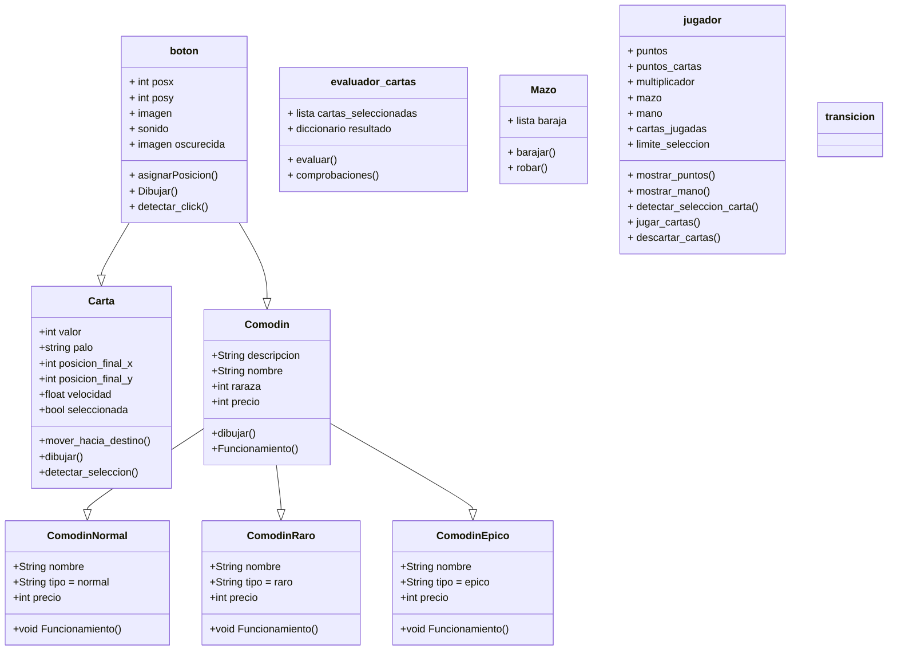

# Naipo


##

### Como usar:
Ejecutar desde el main.py

Este juego utiliza la versión 3.13 de python junto con la biblioteca pygame 2.6.1

Esta se puede instalar desde "requirements.txt" de la siguiente forma:

```
pip install -r requirements.txt
```

##

### Diagrama de clases:


