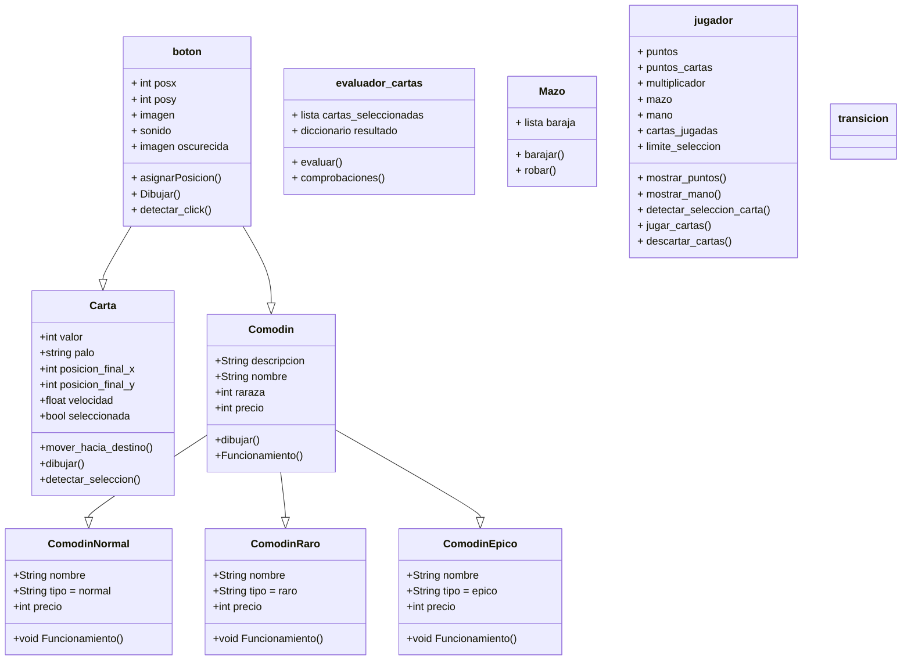

# Naipo


##

1. [Requisitos](#Requisitos)
2. [Clonar este repositorio](#ClonarRepo)
3. [Entorno Virtual](#Venv)
    * 3.1 [Crear Entorno Virtual](#CrearVenv)
    * 3.2 [Inicializar Entorno Virtual](#InicializarVenv)
    * 3.3 [Instalar dependencias](#Dependencias)
    * 3.4 [Comprobación](#Comprobacion)
4. [Ejecución](#Ejecucion)
5. [Diagrama de clases](#Diagrama)

## 1. <a name='Requisitos'>Requisitos</a>

Es necesario tener instalado python 3.13 o posterior.

Este repositorio usa concretamente la versión 3.13.7 de python:  [python.org/downloads/release/python-3137](https://www.python.org/downloads/release/python-3137/)

## 2. <a name='ClonarRepo'>Clonar este repositorio</a>

Para clonar el repositorio se necesita ejecutar:

```bash
git clone https://github.com/Hsandin7/Practica-TPA.git [subcarpeta]
```

donde `[subcarpeta]` es opcional, si se especifica designa el path relativo de una subcarpeta donde quedará alojado el repositorio.


## 3. <a name='Venv'>Entorno Virtual</a>

### 3.1 <a name='CrearVenv'>Crear Entorno Virtual</a>

Para crear el entorno virtual se debe introducir en la terminal:

```bash
python -m venv .venv
```

Seleccionando el compilador de python correspondiente (python 3.13.x)

### 3.2 <a name='InicializarVenv'>Inicializar Entorno Virtual</a>

Según el sistema operativo, se inicializará el entorno virtual introduciendo en la terminal:

```cmd
# Windows:
.venv\Scripts\activate
```

```bash
# Linux o MacOS:
source .venv/bin/activate
```

### 3.3 <a name='Dependencias'>Instalar dependencias</a>

Finalmente, se instalan las dependencias introduciendo en la terminal:

```bash
pip install -r requirements.txt
```

### 3.4 <a name='Comprobacion'>Comprobación</a>

Para comprobar que se ha creado e inicializado correctamente se puede introducir en la terminal:

```bash
pip list
```

Si se ha creado todo correctamente debería devolver algo así:

```bash
Package Version
------- -------
pip     25.2
pygame  2.6.1
```

## 4. <a name='Ejecucion'>Ejecución</a>

Para iniciar el proyecto hay que ejecutar el main.py

Para ello, se puede ejecutar desde el editor de código que esté usando o introduciendo en la terminal:

```bash
python main.py
```

## 5. <a name='Diagrama'>Diagrama de clases</a>



## 6. Documentacion

Para el generar la documentacion es necesario el uso de pdoc. Instala los reqauirements de desarollador:

```bash
pip install -r requirements-dev.txt
```

Generando docs

```bash
pdoc -o docs src
```
